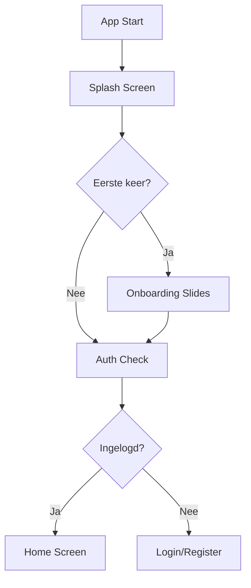
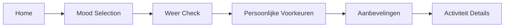
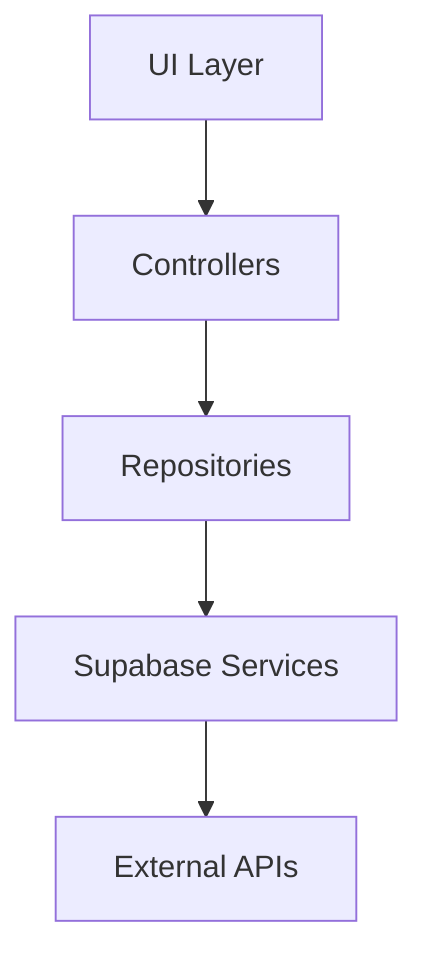

# WanderMood - App Flow & Structuur

## 1. User Journey Flow

### 1.1 Initial Flow


### 1.2 Authenticatie Flow
1. **Login Opties**
   - Email/Wachtwoord
   - Google Sign-in
   - Apple Sign-in
   - Facebook Login
2. **Registratie Process**
   - Basis informatie
   - Voorkeuren setup
   - Notificatie permissies
3. **Password Recovery**
   - Reset email
   - Verificatie
   - Nieuw wachtwoord

## 2. Main Navigation Structure

### 2.1 Bottom Tab Navigation
- **Home**: Mood-based recommendation hub
- **Explore**: Discovery en zoekfunctionaliteit
- **Stories**: Sociale sharing component
- **Plan**: Reis planning en management
- **Profile**: Gebruikersinstellingen en voorkeuren

### 2.2 Key User Journeys

#### Mood-Based Discovery Flow


#### Activity Booking Flow
1. **Activiteit Details**
   - Beschrijving
   - Foto's
   - Prijzen
   - Reviews
   
2. **Booking Process**
   - Datum/tijd selectie
   - Aantal deelnemers
   - Extra opties
   - Betaling
   - Bevestiging

#### Social Sharing Flow
1. **Content Creatie**
   - Foto/video upload
   - Captions toevoegen
   - Locatie tags
   - Mood tags

2. **Publishing**
   - Preview en bewerken
   - Delen op persoonlijke feed
   - Delen op publieke feed
   - Interactie mogelijkheden

#### Trip Planning Flow
1. **Trip Creatie**
   - Datum selectie
   - Bestemming kiezen
   - Activiteiten toevoegen
   - Itinerary bouwen

2. **Management**
   - Timeline weergave
   - Delen met anderen
   - Herinneringen instellen
   - Notificaties beheren

## 3. Feature Modules

### 3.1 User Management
- **Profiel Beheer**
  - Persoonlijke informatie
  - Voorkeuren
  - Betaalmethoden
  - Privacy instellingen

- **Content Management**
  - Favorieten
  - Booking geschiedenis
  - Gedeelde stories
  - Saved trips

### 3.2 Sociale Features
- Stories creatie en delen
- Vrienden connecties
- Activiteiten delen
- Commentaar en likes
- Chat functionaliteit

### 3.3 Planning & Booking
- Trip planning tools
- Booking management
- Betaling verwerking
- Notificaties systeem

## 4. Technische Architectuur

### 4.1 Frontend Structuur
```
lib/
├── presentation/
│   ├── onboarding/
│   │   ├── splash_screen.dart
│   │   └── onboarding_screens.dart
│   ├── auth/
│   │   ├── login_screen.dart
│   │   ├── register_screen.dart
│   │   └── password_reset_screen.dart
│   ├── home/
│   │   ├── home_screen.dart
│   │   ├── mood_selection_screen.dart
│   │   └── weather_widget.dart
│   ├── explore/
│   │   ├── discover_screen.dart
│   │   ├── search_screen.dart
│   │   └── filter_screen.dart
│   ├── stories/
│   │   ├── stories_feed.dart
│   │   ├── create_story.dart
│   │   └── story_details.dart
│   ├── planning/
│   │   ├── trip_planner.dart
│   │   ├── itinerary_screen.dart
│   │   └── booking_screen.dart
│   └── profile/
│       ├── profile_screen.dart
│       ├── settings_screen.dart
│       └── preferences_screen.dart
```

### 4.2 State Management
- **Global States**
  - AuthState
  - UserState
  - NavigationState
  - BookingState

- **Feature States**
  - MoodState
  - StoryState
  - TripState
  - SearchState

### 4.3 Data Flow


## 5. Technical Considerations

### 5.1 Performance
- Lazy loading voor images
- Offline support
- Caching strategie
- Background processes

### 5.2 Security
- Authentication flow
- Data encryption
- Secure storage
- API security

### 5.3 Integration
- Deep linking
- Social media sharing
- Payment gateway
- Maps integratie

### 5.4 Analytics
- User behavior tracking
- Performance metrics
- Error logging
- Conversion tracking

## 6. Implementatie Planning

### Fase 1: MVP (Week 1-4)
- [x] Basic auth flow
- [ ] Mood selection
- [ ] Basic recommendations
- [ ] Simple booking flow

### Fase 2: Core Features (Week 5-8)
- [ ] Stories functionality
- [ ] Trip planning
- [ ] Advanced recommendations
- [ ] Social features

### Fase 3: Enhancement (Week 9-12)
- [ ] Deep linking
- [ ] Offline support
- [ ] Performance optimization
- [ ] Analytics integration

---

*Laatste update: [DATUM]*

## Contact
Voor technische vragen, neem contact op met het development team. 